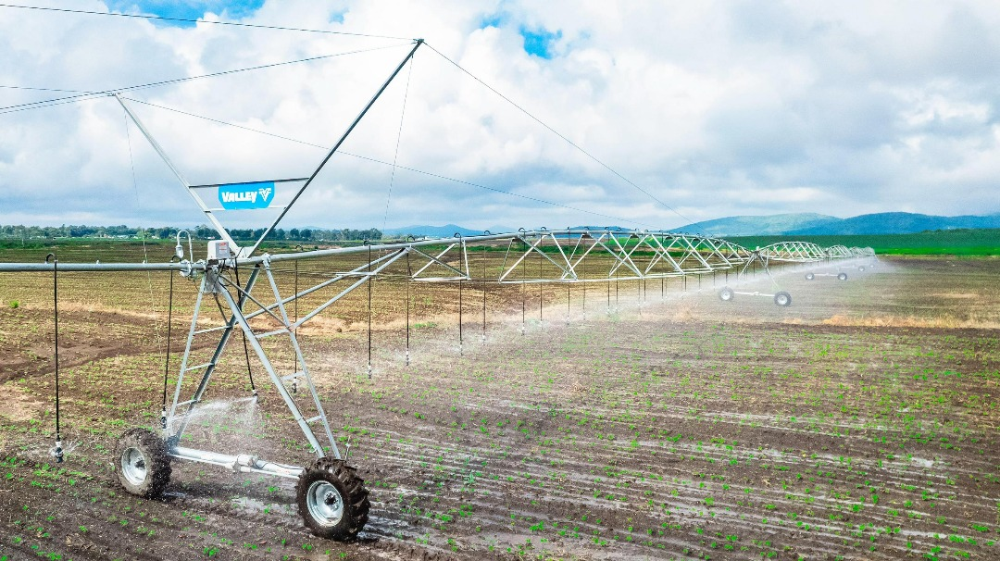
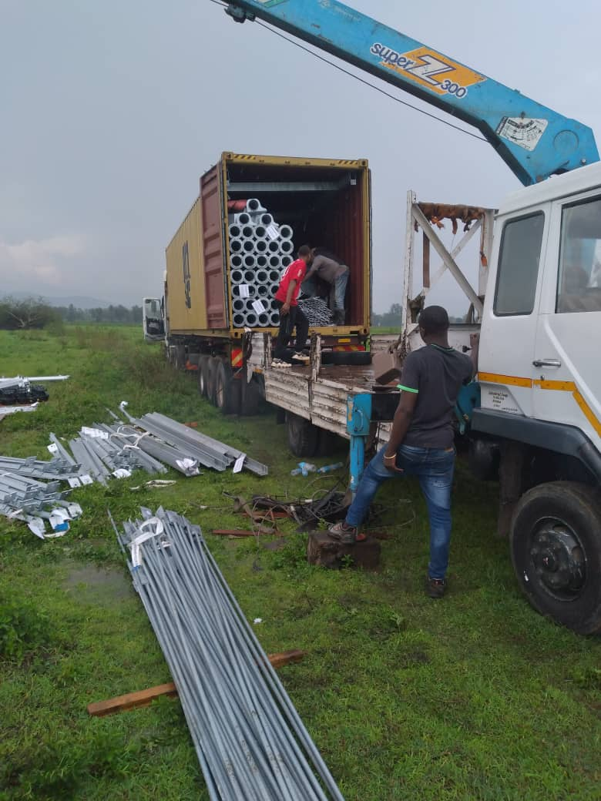

# Image Optimization Guide
**Pro Agro Global Website**  
**Date:** October 13, 2025

---

## 📊 Current Image Inventory

### Total Images: 48
**Files:** `IMG-20251008-WA0069.jpg` through `IMG-20251008-WA0112.jpg`  
**Location:** `assets/images/`

### Image Distribution by Page

#### Homepage (12 images)
- IMG-20251008-WA0069.jpg → Hero background
- IMG-20251008-WA0070.jpg → Service card: Irrigation
- IMG-20251008-WA0071.jpg → Service card: Greenhouses
- IMG-20251008-WA0072.jpg → Service card: Geomembranes
- IMG-20251008-WA0073.jpg → Service card: Civil Engineering
- IMG-20251008-WA0074.jpg → Projects gallery
- IMG-20251008-WA0075.jpg → Projects gallery
- IMG-20251008-WA0076.jpg → Projects gallery
- IMG-20251008-WA0077.jpg → Projects gallery
- IMG-20251008-WA0078.jpg → Projects gallery
- IMG-20251008-WA0079.jpg → Projects gallery
- IMG-20251008-WA0080.jpg → Testimonials background

#### About Page (5 images)
- IMG-20251008-WA0081.jpg → Hero background
- IMG-20251008-WA0082.jpg → Story grid
- IMG-20251008-WA0083.jpg → Story grid
- IMG-20251008-WA0084.jpg → Story grid
- IMG-20251008-WA0085.jpg → Story grid

#### Services Page (14 images)
- IMG-20251008-WA0086.jpg → Hero background (also reused in Civil section)
- IMG-20251008-WA0087.jpg → Irrigation section
- IMG-20251008-WA0088.jpg → Irrigation section
- IMG-20251008-WA0089.jpg → Irrigation section
- IMG-20251008-WA0090.jpg → Irrigation section
- IMG-20251008-WA0091.jpg → Greenhouses section
- IMG-20251008-WA0092.jpg → Greenhouses section
- IMG-20251008-WA0093.jpg → Greenhouses section
- IMG-20251008-WA0094.jpg → Greenhouses section
- IMG-20251008-WA0095.jpg → Geomembranes section
- IMG-20251008-WA0096.jpg → Geomembranes section
- IMG-20251008-WA0097.jpg → Geomembranes section
- IMG-20251008-WA0098.jpg → Civil Engineering section
- IMG-20251008-WA0099.jpg → Civil Engineering section

#### Gallery Page (13 new + 5 reused = 18 displayed)
**New images:**
- IMG-20251008-WA0100.jpg → Hero background
- IMG-20251008-WA0101.jpg → Gallery item
- IMG-20251008-WA0102.jpg → Gallery item
- IMG-20251008-WA0103.jpg → Gallery item
- IMG-20251008-WA0104.jpg → Gallery item
- IMG-20251008-WA0105.jpg → Gallery item
- IMG-20251008-WA0106.jpg → Gallery item
- IMG-20251008-WA0107.jpg → Gallery item
- IMG-20251008-WA0108.jpg → Gallery item
- IMG-20251008-WA0109.jpg → Gallery item
- IMG-20251008-WA0110.jpg → Gallery item
- IMG-20251008-WA0111.jpg → Gallery item
- IMG-20251008-WA0112.jpg → Gallery item

**Reused from Services:**
- IMG-20251008-WA0087.jpg → Irrigation gallery
- IMG-20251008-WA0091.jpg → Greenhouses gallery
- IMG-20251008-WA0095.jpg → Geomembranes gallery
- IMG-20251008-WA0098.jpg → Civil gallery
- IMG-20251008-WA0099.jpg → Civil gallery

#### Contact Page (1 reused)
- IMG-20251008-WA0069.jpg → Hero background (reused from homepage)

### Summary
- **44 unique images used** (92% of total 48 images)
- **4 images unused:** WA0113-WA0116 (if they exist)
- **Some images reused across pages** (efficient)

---

## 🎯 Optimization Goals

### Target Metrics
- **File size reduction:** 70-80%
- **Quality:** No visible degradation
- **Format:** Keep as JPG (best for photographs)
- **Performance impact:** Reduce page load time by 40-60%

### Before Optimization
- Typical original size: 2-5 MB per image
- Total estimated: 96-240 MB (48 images × 2-5 MB)
- Page load time: Likely 5-10 seconds

### After Optimization Target
- Target size: 100-300 KB per image
- Total target: 4.8-14.4 MB (48 images × 100-300 KB)
- Expected load time: 2-3 seconds

---

## 🛠️ Recommended Tools

### Option 1: TinyPNG (Recommended for Batch Processing)
**Website:** https://tinypng.com/

**Pros:**
- Upload up to 20 images at once
- Smart lossy compression
- Very easy to use
- Excellent results

**Process:**
1. Visit https://tinypng.com/
2. Drag and drop up to 20 images
3. Wait for compression
4. Download all as ZIP
5. Repeat for remaining images

**Limitations:**
- Max 5 MB per file
- Max 20 files per batch
- Requires internet connection

---

### Option 2: Squoosh (More Control)
**Website:** https://squoosh.app/

**Pros:**
- More compression options
- Preview before/after
- Works offline (PWA)
- Multiple format options

**Process:**
1. Visit https://squoosh.app/
2. Upload one image
3. Adjust quality slider (recommended: 75-85)
4. Compare original vs compressed
5. Download optimized version
6. Repeat for each image

**Limitations:**
- One image at a time
- More manual work

---

### Option 3: ImageOptim (macOS Only)
**Download:** https://imageoptim.com/

**Pros:**
- Drag and drop multiple files
- Lossless and lossy options
- Batch processing
- Free and open source

**Process:**
1. Download and install ImageOptim
2. Drag entire `assets/images/` folder onto app
3. Wait for optimization
4. Files are optimized in place

---

### Option 4: RIOT (Windows)
**Download:** https://riot-optimizer.com/

**Pros:**
- Windows native app
- Preview comparison
- Batch mode available
- Free

**Process:**
1. Download and install RIOT
2. Open image
3. Adjust quality
4. Save optimized version
5. Use batch mode for multiple files

---

### Option 5: Command Line (Advanced)
**Tool:** ImageMagick or jpegoptim

**For all JPGs:**
```bash
# ImageMagick (install first)
magick mogrify -quality 80 -strip assets/images/*.jpg

# OR jpegoptim (Linux/Mac)
jpegoptim --max=80 --strip-all assets/images/*.jpg
```

---

## 📋 Step-by-Step Optimization Process

### IMPORTANT: Backup First! ⚠️

```powershell
# In PowerShell, from project root:
Copy-Item -Path "assets/images" -Destination "assets/images_original_backup" -Recurse
```

This creates: `assets/images_original_backup/` with all original files.

---

### Method 1: Using TinyPNG (Recommended)

**Step 1:** Select images in batches
```powershell
# Navigate to images folder
cd assets/images

# View all WA images
Get-ChildItem IMG-20251008-WA*.jpg
```

**Step 2:** Batch 1 - WA0069 to WA0088 (20 images)
1. Select files WA0069.jpg through WA0088.jpg
2. Drag to https://tinypng.com/
3. Wait for compression
4. Click "Download all" → Save as `batch1.zip`
5. Extract and replace original files

**Step 3:** Batch 2 - WA0089 to WA0108 (20 images)
1. Select files WA0089.jpg through WA0108.jpg
2. Repeat process
3. Save as `batch2.zip`

**Step 4:** Batch 3 - WA0109 to WA0112 (4 images)
1. Select remaining files
2. Compress
3. Save as `batch3.zip`

**Step 5:** Replace files
```powershell
# In PowerShell:
# Extract each batch ZIP and copy files to assets/images/
# Overwrite when prompted
```

---

### Method 2: Using Squoosh (More Precision)

**Best for:** Hero images and prominent photos

**Process:**
1. Open https://squoosh.app/
2. Upload `IMG-20251008-WA0069.jpg` (homepage hero)
3. Choose "MozJPEG" encoder
4. Set quality to **80**
5. Compare:
   - Original size vs compressed
   - Visual quality (zoom in)
6. If quality good → Download
7. If quality poor → Increase to 85
8. Repeat for each important image

**Priority images to check manually:**
- WA0069.jpg (homepage hero)
- WA0081.jpg (about hero)
- WA0086.jpg (services hero)
- WA0100.jpg (gallery hero)

---

## 🔍 Quality Check After Optimization

### Visual Inspection
Open website in browser and check:

**Homepage:**
- [ ] Hero background sharp
- [ ] Service card images clear
- [ ] Projects gallery images good quality
- [ ] No pixelation or artifacts

**About Page:**
- [ ] Hero image sharp
- [ ] Story grid images clear (4 images)

**Services Page:**
- [ ] Hero background sharp
- [ ] All 14 service images clear
- [ ] No blurriness on zoom

**Gallery Page:**
- [ ] All 18 images display well
- [ ] Lightbox images look good when enlarged
- [ ] No quality issues

**Contact Page:**
- [ ] Hero image sharp

### File Size Check
```powershell
# Check file sizes after optimization
Get-ChildItem assets/images/IMG-20251008-WA*.jpg | Select-Object Name, @{Name="Size(KB)";Expression={[math]::Round($_.Length/1KB,2)}} | Format-Table

# Calculate total size
(Get-ChildItem assets/images/IMG-20251008-WA*.jpg | Measure-Object -Property Length -Sum).Sum / 1MB
```

**Expected results:**
- Individual files: 100-300 KB each
- Total: < 15 MB for all 48 images

---

## 📊 Performance Measurement

### Before Optimization
Run PageSpeed Insights: https://pagespeed.web.dev/

**Record scores:**
- Homepage: Desktop ___ / Mobile ___
- About: Desktop ___ / Mobile ___
- Services: Desktop ___ / Mobile ___
- Gallery: Desktop ___ / Mobile ___
- Contact: Desktop ___ / Mobile ___

### After Optimization
Run PageSpeed Insights again:

**Target improvements:**
- Homepage: Desktop 90+ / Mobile 85+
- About: Desktop 90+ / Mobile 85+
- Services: Desktop 88+ / Mobile 82+
- Gallery: Desktop 85+ / Mobile 80+
- Contact: Desktop 90+ / Mobile 85+

**Expected improvements:**
- Largest Contentful Paint (LCP): 40-60% faster
- Total page size: 70-80% reduction
- Load time: 50% faster

---

## 🚀 Advanced Optimization (Optional)

### Add Lazy Loading
Update image tags to include loading attribute:

```html
<!-- Before: -->


<!-- After: -->

```

**Note:** Don't add to hero images (above fold) - they should load immediately.

### Responsive Images (srcset)
For hero images, provide multiple sizes:

```html

```

### Convert to WebP (Modern Format)
**Better compression, but requires more work:**

```powershell
# Using ImageMagick:
magick IMG-20251008-WA0069.jpg IMG-20251008-WA0069.webp -quality 80
```

Then use `<picture>` element:
```html
<picture>
  <source srcset="assets/images/IMG-20251008-WA0069.webp" type="image/webp">
  
</picture>
```

---

## ✅ Optimization Checklist

### Preparation
- [x] Backup original images to `assets/images_original_backup/`
- [ ] Choose optimization tool (TinyPNG recommended)
- [ ] Test tool with 1-2 images first

### Compression
- [ ] Batch 1: Compress WA0069-WA0088 (20 images)
- [ ] Batch 2: Compress WA0089-WA0108 (20 images)
- [ ] Batch 3: Compress WA0109-WA0112 (4-8 images)
- [ ] Replace original files with compressed versions

### Quality Check
- [ ] Open website in browser
- [ ] Check homepage images
- [ ] Check about page images
- [ ] Check services page images (14 images)
- [ ] Check gallery page images (18 images)
- [ ] Check contact page image
- [ ] Verify lightbox images look good when enlarged
- [ ] No visible quality loss or artifacts

### Performance Testing
- [ ] Run PageSpeed Insights on homepage (before)
- [ ] Run PageSpeed Insights on all pages (after)
- [ ] Compare load times
- [ ] Verify LCP improvement
- [ ] Check total page sizes

### Final Steps
- [ ] Document file size reduction
- [ ] Update RENOVATION_COMPLETE.md with results
- [ ] Keep backup folder safe
- [ ] Celebrate! 🎉

---

## 📝 Results Documentation

**Optimization completed on:** _____________

**Tool used:** _____________

**Results:**
- Original total size: _____ MB
- Optimized total size: _____ MB
- Reduction: _____ % 
- Quality: Excellent / Good / Acceptable

**PageSpeed Improvements:**
- Homepage: ___ → ___
- About: ___ → ___
- Services: ___ → ___
- Gallery: ___ → ___
- Contact: ___ → ___

**Issues encountered:** 
_____________

**Notes:**
_____________

